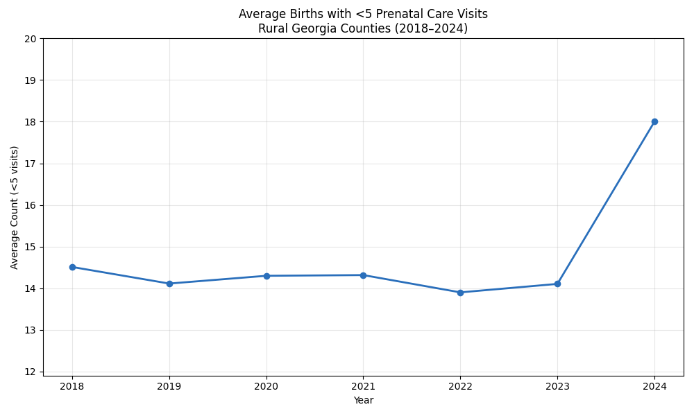
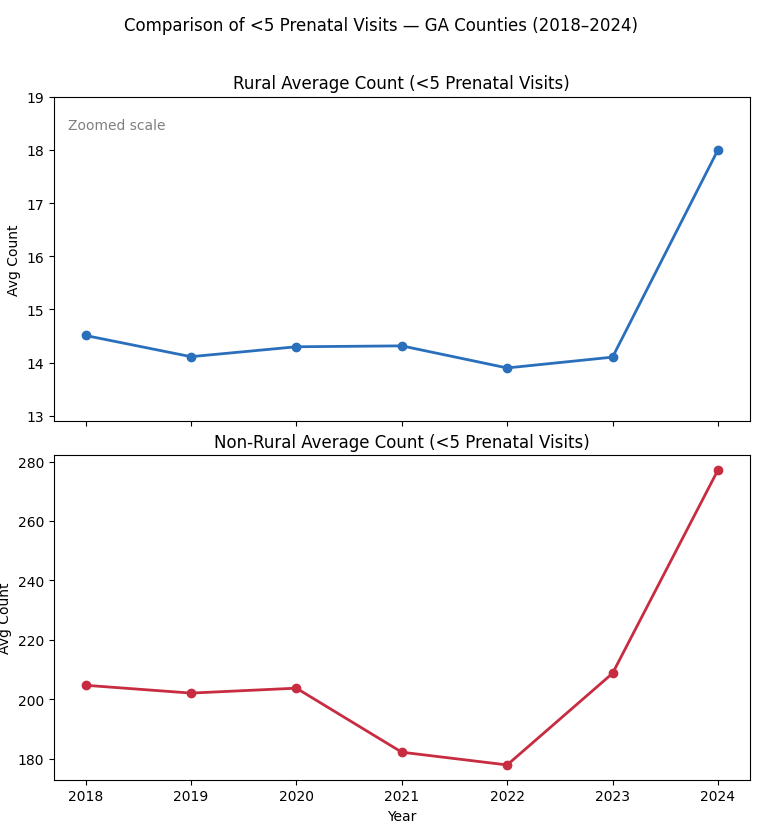
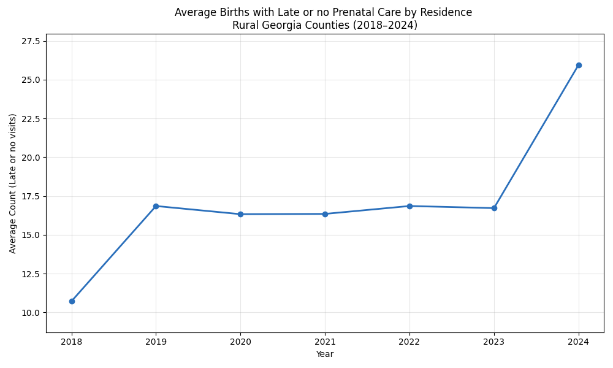
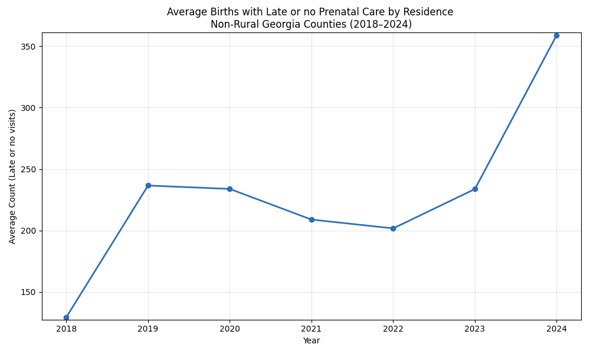

# Prenatal Care Access in Georgia (2018–2024)

This project analyzes prenatal care access trends across Georgia using (publicly available county-level birth outcome data)[https://oasis.state.ga.us/oasis/webquery/qryBirth.aspx]. The focus is on two key indicators of prenatal care access:

Fewer than 5 Prenatal Care Visits

Late or No Prenatal Care

Counts are aggregated separately for rural vs. non-rural Georgia counties to highlight disparities in maternal healthcare access.

## Data Overview

Time period: 2018–2024
Geographic units: 159 Georgia counties
Grouping: Rural vs. Non-Rural residency
Source: Georgia Department of Public Health, OASIS Birth Data

Metrics measured:

Average counts per county per year

Comparing access outcomes across residence types

## Results

Significant differences emerged between rural and non-rural regions — and both groups saw concerning spikes in 2024.

### 1. Fewer Than 5 Prenatal Care Visits
Rural Georgia Counties

Average cases remained fairly stable until 2023, followed by a sharp increase in 2024.

* *Figure 1: Rural Average <5 Prenatal Visits (2018–2024)* *

Non-Rural Georgia Counties

Non-rural counties show consistently higher counts and the same spike pattern in 2024.

* *Figure 2: Non-Rural Average <5 Prenatal Visits (2018–2024)* *

Rural vs Non-Rural Comparison (Zoomed Rural)

Both lines show deterioration in recent years, especially starting in 2023–2024.

* *Figure 3: Rural vs Non-Rural (<5 Prenatal Visits Comparison)* *

-Key Observation

Non-rural counties have 10–15× the recorded case counts of rural counties, but both categories show worsening access in 2024.

### 2. Late or No Prenatal Care
Rural Georgia Counties

Rural counties show a notable rise in 2024, reaching the highest levels in the time series.

* *Figure 4: Rural Late/No Prenatal Care (2018–2024)* *

Non-Rural Georgia Counties

Even counties with more healthcare access experienced a major jump in 2024.

* *Figure 5: Non-Rural Late/No Prenatal Care (2018–2024)* *

Rural vs Non-Rural Comparison (Zoomed Rural)

Highlights both the scale gap and parallel rise in recent years.

* *Figure 6: Rural vs Non-Rural (Late/No Care Comparison)* *

-Key Observation

Worsening late/no prenatal care is not isolated to rural shortages — it reflects broader statewide maternal health challenges.

# Interpretation & Public Health Significance

-Rural communities carry a higher proportional burden, with fewer prenatal providers and longer care travel distances
-Non-rural counties also show significant worsening in 2024, suggesting system-wide stressors
-The shared statewide increase points to:

-> Obstetric workforce reductions

-> Hospital/maternity ward closures

-> Rising insurance/access barriers

**The 2023 → 2024 spike should be viewed as a public health warning.**

Tech Stack:
Category | Details
Language | Python 3.12
Libraries	| Pandas, Seaborn, Matplotlib
Processing	| CSV cleaning, rural/non-rural grouping, yearly aggregation
Visuals	Line charts, comparison subplots
